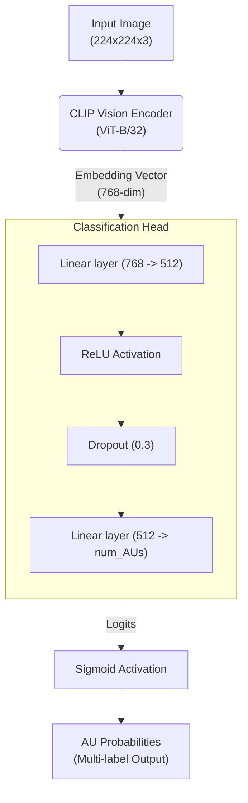

# Hệ Thống Phát Hiện Action Unit (AU) dựa trên CLIP

## 1. Giới thiệu dự án

**Mục tiêu:**
Dự án này xây dựng một hệ thống phát hiện Action Unit (AU) trên khuôn mặt bằng cách tận dụng sức mạnh trích xuất đặc trưng hình ảnh vượt trội của mô hình CLIP (Contrastive Language-Image Pre-Training). Hệ thống được thiết kế linh hoạt, dễ dàng fine-tune trên các tập dữ liệu AU, phục vụ cho bài toán phân loại đa nhãn (Multi-label classification).

**Ý nghĩa Action Unit:**
Facial Action Coding System (FACS) phân chia các chuyển động trên khuôn mặt thành các Action Unit (AU) riêng lẻ. Việc tự động phát hiện chính xác các AU mang ý nghĩa quan trọng trong:

- Nhận dạng cảm xúc và trạng thái tâm lý.
- Phân tích hành vi con người trong giao tiếp, y tế (phát hiện trầm cảm, tự kỷ), và giáo dục.
- Tạo ra các avatar kỹ thuật số hoặc nhân vật hoạt hình chân thực (CGI).

---

## 2. Kiến trúc hệ thống

### 2.1. Giải thích CLIP backbone

CLIP (từ OpenAI) bao gồm hai bộ mã hóa (encoder): Text Encoder và Image Encoder (thường dùng cấu trúc ViT - Vision Transformer hoặc ResNet). Mô hình gốc được huấn luyện trên hàng trăm triệu cặp ảnh-văn bản, giúp nó có khả năng trích xuất các đặc trưng hình ảnh (visual features) cực kỳ phong phú và mang tính tổng quát hóa cao.

### 2.2. Sơ đồ mô hình cho AU Detection

Trong bài toán này, hệ thống **chỉ sử dụng Image Encoder (ViT-B/32)** của CLIP và loại bỏ hoàn toàn Text Encoder.



**Workflow:**

1. **Input:** Hình ảnh khuôn mặt (đã resize về `224x224` và chuẩn hóa theo mean/std của CLIP).
2. **Backbone:** CLIP Vision Encoder (`openai/clip-vit-base-patch32`) trích xuất ra embedding vector (thường có chiều `768` đối với ViT-B/32, sau pooler).
3. **Classification Head:** Cụm phân loại tùy biến được thêm vào thay thế:
   - `Linear(768 -> 512)`
   - `ReLU` (Hàm kích hoạt)
   - `Dropout(0.3)` (Chống overfitting)
   - `Linear(512 -> num_AUs)`
4. **Output:** Logits (kích thước `num_AUs`). Áp dụng hàm `Sigmoid` để tính giá trị xác suất (từ 0 đến 1) cho từng AU độc lập. Hàm Loss sử dụng là `BCEWithLogitsLoss`.

---

## 3. Cài đặt môi trường

Hệ thống yêu cầu **Python 3.8+**.

Các bạn cài đặt các thư viện cần thiết thông qua `pip`:

```bash
pip install torch torchvision
pip install transformers
pip install pandas numpy scikit-learn pillow
pip install pyyaml tqdm tensorboard
```

_(Lưu ý: Nếu sử dụng GPU, hãy cài phiên bản PyTorch tương thích với CUDA trên máy của bạn tại [pytorch.org](https://pytorch.org/get-started/locally/))._

---

## 4. Chuẩn bị dữ liệu

### 4.1. Cấu trúc thư mục mong đợi

```
CLIP/
├── AUs_DATA/
│   ├── images/
│   │   ├── img_0001.jpg
│   │   ├── img_0002.jpg
│   │   └── ...
│   └── labels.csv
```

### 4.2. Format file CSV (`labels.csv`)

File CSV cần có cột đầu tiên là tên file ảnh, các cột tiếp theo là nhãn nhị phân (0 hoặc 1) tượng trưng cho sự xuất hiện của các AUs.

**Ví dụ nhãn AU:**

```csv
filename,AU1,AU2,AU4,AU6,AU12,AU15
img_0001.jpg,1,1,0,0,1,0
img_0002.jpg,0,0,1,1,0,1
```

---

## 5. Hướng dẫn train (Huấn luyện)

Trước khi train, bạn có thể tinh chỉnh các siêu tham số (Hyperparameters) trong file `config.yaml`:

- `batch_size`: Số lượng ảnh mỗi bước (ví dụ: `32`).
- `learning_rate`: Tốc độ học (khuyên dùng `2e-5` cho việc fine-tune backbone mạnh như CLIP).
- `freeze_backbone`: Set thành `true` nếu bạn chỉ muốn train Classification Head, hoặc `false` để fine-tune toàn bộ mô hình (tốn VRam hơn nhưng hiệu quả hơn).
- `mixed_precision`: Hệ thống hỗ trợ Mixed Precision Training giúp giảm lượng VRAM tiêu thụ và tăng tốc độ huấn luyện.

**Lệnh chạy:**

```bash
python train.py
```

Hệ thống sẽ tự động bắt đầu huấn luyện, tính toán các metrics trên tập Validation sau mỗi epoch, lưu log định dạng TensorBoard trong thư mục `logs/`, và tự động lưu mô hình tốt nhất (dựa trên F1-Macro) vào `models/checkpoints/best_clip_au.pth`.

---

## 6. Hướng dẫn test (Đánh giá)

Khi mô hình đã train xong, bạn có thể chạy tệp `eval.py` để tính điểm số chi tiết trên phần dữ liệu test (test split).

**Lệnh evaluate:**

```bash
python eval.py
```

**Cách đọc kết quả:**
Script sẽ xuất ra màn hình (Console) các chỉ số:

- **F1 Macro / Micro:** Sự cân bằng giữa Precision và Recall. Macro trung bình mọi classes như nhau, Micro xem mọi nhãn như nhau.
- **Precision:** Độ chính xác (Trong số những AU mô hình dự đoán Positive, bao nhiêu là đúng).
- **Recall:** Độ bao phủ (Trong số những AU thực tế là Positive, mô hình đã tìm ra bao nhiêu).
- **ROC AUC Macro:** Đo lường khả năng phân tách giữa hai lớp Positive và Negative ở nhiều ngưỡng khác nhau.
- **Per-class F1:** Chi tiết F1 score cho từng AU (vd: AU 1, AU 2,...).

---

## 7. Hướng dẫn inference (Dự đoán ảnh mới)

Bạn có thể test trực tiếp một hình ảnh mới thông qua hàm `predict` trong tệp `inference.py`. Model sẽ load trọng số lưu lượng tốt nhất tự động.

**Lệnh chạy thử một ảnh:**

```bash
python inference.py path/to/your/image.jpg
```

(Có thể truyền cờ `--config path/to/config.yaml` nếu file config tùy biến).

---

## 8. Ví dụ kết quả đầu ra

Kết quả được in ra Console dạng nhị phân và xác suất đi kèm đối với hình ảnh khuôn mặt đưa vào:

```text
Loaded weights from models/checkpoints/best_clip_au.pth
Predicted AUs (Threshold 0.5):
AU 00: 1 (Prob: 0.9421)
AU 01: 1 (Prob: 0.8102)
AU 02: 0 (Prob: 0.0514)
AU 03: 0 (Prob: 0.1235)
AU 04: 1 (Prob: 0.9856)
...
```

Vectơ nhị phân kết quả ví dụ sẽ là `[1, 1, 0, 0, 1]`, diễn giải được là người này có hiện diện các Action Units: 00, 01, và 04.

---

## 9. Cách mở rộng hệ thống

Mã nguồn được cấu trúc module hoá, hỗ trợ dễ dàng mở rộng:

- **Weighted Loss:** Nếu dữ liệu bị lệch chuẩn (Imbalanced Dataset), hãy cập nhật `pos_weight` tại phần cấu hình `nn.BCEWithLogitsLoss()` trong `train.py`.
- **Intensity Regression:** Thay đổi nhãn dữ liệu thực tế thành các số nguyên cường độ (0-5), đổi Loss Function thành `MSELoss` (và loại bỏ lớp Sigmoid cuối) để giải quyết bài toán hồi quy (Dự đoán mức độ chứ không chỉ Yes/No).
- **Stratified KFolds:** Cập nhật hàm chia dữ liệu trong `dataset.py` với các thư viện thứ 3 (như `skmultilearn.model_selection`) để cho ra Cross Validation chia đều hơn.

---

## 10. Tài liệu tham khảo

1. Radford, A., et al. (2021). "Learning Transferable Visual Models From Natural Language Supervision." (CLIP Paper).
2. HuggingFace Transformers: [https://huggingface.co/docs/transformers](https://huggingface.co/docs/transformers)
3. Ekman, P., & Friesen, W. V. (1978). "Facial Action Coding System."
