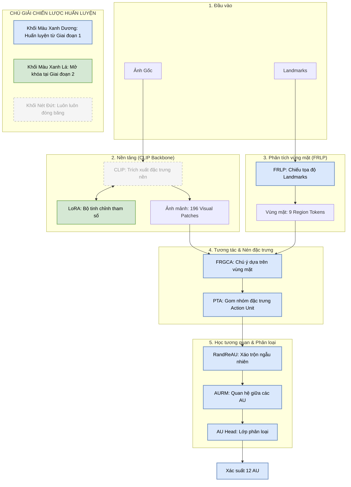

# Tổng Kết Triển Khai: AU Detection System

Dự án đã hoàn thành việc chuyển đổi architecture CLIP-ReID sang hệ thống nhận diện Facial Action Unit (AU) và giải thích bằng ngôn ngữ tự nhiên.

## Các Thành Phần Đã Triển Khai

| Component | Files | Description |
|---|---|---|
| **Data Processing** | [prepare_data.py](file:///d:/CLIP-ReID/prepare_data.py) | Xử lý DISFA labels thô (intensity) sang CSV binary (activation >= 2). |
| **Dataset Loader** | [datasets/disfa.py](file:///d:/CLIP-ReID/datasets/disfa.py) | Lớp Dataset chuyên biệt cho DISFA, hỗ trợ multi-label. |
| **Transforms** | [datasets/preprocessing.py](file:///d:/CLIP-ReID/datasets/preprocessing.py) | Thêm AU-specific transforms (face-safe, bỏ RandomErasing). |
| **Model** | [model/au_head.py](file:///d:/CLIP-ReID/model/au_head.py)<br>[model/make_model.py](file:///d:/CLIP-ReID/model/make_model.py) | Thay classifier ReID bằng [AUHead](file:///d:/CLIP-ReID/model/au_head.py#11-19) (12 classes). Output sigmoid khi inference. |
| **Loss Function** | [loss/au_loss.py](file:///d:/CLIP-ReID/loss/au_loss.py)<br>[loss/make_loss.py](file:///d:/CLIP-ReID/loss/make_loss.py) | Triển khai [WeightedBCELoss](file:///d:/CLIP-ReID/loss/au_loss.py#4-24) để xử lý class imbalance trong DISFA. |
| **Training Pipeline** | [processor/processor_au.py](file:///d:/CLIP-ReID/processor/processor_au.py)<br>[train_au.py](file:///d:/CLIP-ReID/train_au.py) | Loop huấn luyện đặc thù cho AU và [AUEvaluator](file:///d:/CLIP-ReID/processor/processor_au.py#11-56) (F1, AUC metrics). |
| **Explanation** | [au_explainer.py](file:///d:/CLIP-ReID/au_explainer.py) | Module Rule-based chuyển AU vector sang câu mô tả tiếng Anh và cảm xúc. |
| **Inference** | [inference_au.py](file:///d:/CLIP-ReID/inference_au.py) | Full pipeline: Image → CLIP → AU Head → Explainer → Text. |

## Sơ đồ Hệ thống Hợp nhất (Unified Architecture & Strategy)

Sơ đồ dưới đây thể hiện chi tiết luồng dữ liệu kỹ thuật kết hợp với chiến lược huấn luyện 2 giai đoạn:



### Phân tích Luồng Dữ liệu Hợp nhất

Sơ đồ trên minh họa sự tích hợp sâu giữa thông tin không gian từ Landmarks và thông tin hình ảnh từ CLIP:

1.  **Luồng Hình ảnh**: Ảnh gốc đi qua CLIP Backbone. Tại đây, **LoRA Adapters** đóng vai trò là các thành phần tùy chỉnh, được giữ đóng băng ở GĐ1 để ổn định đặc trưng, và chỉ mở khóa ở GĐ2 để tinh chỉnh kiến thức của CLIP cho bài toán Action Unit.
2.  **Luồng Landmarks**: Tọa độ Landmarks được chiếu thành **Region Tokens** thông qua module **FRLP**. Các token này hoạt động như một "bản đồ chỉ đường" cho encoder.
3.  **Cơ chế Tương tác (Intersection)**:
    *   **FRGCA**: Thực hiện Cross-Attention giữa Visual Patches và Region Tokens để mô hình "biết" chỗ nào trên khuôn mặt cần chú ý nhất.
    *   **PTA**: Gom nhóm các vùng ảnh đã được chú ý về 12 AU-specific tokens.
4.  **Học tương quan (Relational)**: Các AU tokens được xáo trộn ngẫu nhiên (**RandReAU**) trước khi đi qua **AURelational** để mô hình không bị phụ thuộc vào thứ tự cố định, từ đó học được mối quan hệ logic giữa các bó cơ (ví dụ: AU6 nheo mắt và AU12 cười).

---

## Quy Trình Thực Hiện (Workflow)

Dự án áp dụng chiến thuật **"Từng bước thích nghi"** để tối ưu hóa sức mạnh của CLIP Foundation Model cho bài toán Action Unit (AU) Detection:

1.  **Giai đoạn 1 - Xác lập Nền tảng (Adaptive Alignment)**:
    *   **Trạng thái**: CLIP Backbone và các lớp LoRA được đóng băng hoàn toàn (`requires_grad = False`).
    *   **Nhiệm vụ**: Ép các module mới (**FRLP, FRGCA, PTA, AU Relational**) học cách trích xuất và gom nhóm thông tin từ các đặc trưng tĩnh của CLIP.
    *   **Mục đích**: Tránh làm xáo trộn không gian vector vốn đã ổn định của CLIP khi các module AU còn đang ở trạng thái sơ khởi (trọng số ngẫu nhiên).

2.  **Giai đoạn 2 - Tinh chỉnh Chuyên sâu (End-to-End Fine-tuning)**:
    *   **Trạng thái**: Các lớp **LoRA Adapters** được mở khóa (`requires_grad = True`).
    *   **Nhiệm vụ**: Cho phép Backbone tự điều chỉnh nhẹ các trọng số (thông qua LoRA) để "phối hợp" tốt nhất với các AU Modules.
    *   **Mục đích**: Đạt được độ chính xác tối đa bằng cách tối ưu hóa toàn bộ pipeline cho nhiệm vụ nhận diện vi biểu cảm.

### Các Module Kỹ thuật Cốt lõi
*   **FRLP & FRGCA**: Dẫn dắt mô hình tập trung vào các bó cơ dựa trên tọa độ landmarks 9 vùng mặt.
*   **PTA & AU Relational**: Gom nhóm thông tin về 12 AU tokens và học mối quan hệ tương quan giữa chúng (ví dụ: AU1 & AU2 thường xuất hiện cùng nhau).
*   **Weighted BCE Loss**: Giám sát quá trình huấn luyện bằng cách cân bằng trọng số giữa các AU phổ biến và AU hiếm gặp.


## Quy Trình Thực Hiện (Workflow)

### 1. Chuẩn bị dữ liệu
Chạy script để tạo file label CSV:
```bash
python prepare_data.py
```

### 2. Huấn luyện (Training)
Chạy script train mới với config AU:
```bash
python train_au.py --config_file configs/au/vit_base_au.yaml
```

### 3. Suy luận (Inference)
Chạy pipeline nhận diện và giải thích cho một ảnh bất kỳ:
```bash
python inference_au.py --image_path path/to/face.jpg --weight_path logs/au_vit_base/ViT-B-16_au_30.pth
```

## Những Thay Đổi Quan Trọng So Với ReID Gốc
- **Loại bỏ RandomErasing**: Đảm bảo không mất thông tin vùng mắt/miệng quan trọng cho AU.
- **Dùng Weighted BCE**: Thay thế cho CrossEntropy + Triplet Loss để phù hợp với multi-label và dữ liệu mất cân bằng.
- **Sigmoid Output**: Chuyển đổi logits sang xác suất độc lập cho từng AU thay vì softmax (vốn chỉ chọn 1 class).


## Cập Nhật Mới Nhất: Transformer-based Landmark-guided Architecture

**Timestamp:** 2026-04-11 16:17:51

### 1. preprocessing_pipeline_changes
* **Module:** datasets/preprocessing.py, datasets/disfa.py
* **Thay đổi (Change Description):** Tích hợp extraction features mới và xử lý landmarks output từ MediaPipe, truyền cùng với Image qua pipeline Dataloader.
* **Tác động hiệu năng dự kiến (Expected Performance Impact):** Tăng nhẹ thời gian I/O lúc load dữ liệu nhưng đảm bảo pipeline ổn định, model có dữ liệu không gian trực tiếp thay vì tự học heuristic.

### 2. mediapipe_integration
* **Module:** datasets/preprocessing.py
* **Thay đổi (Change Description):** Tạo module MediaPipeFaceMeshExtractor trích xuất nhóm tọa độ ảnh thành 9 vùng chuẩn (left_eye, right_eye, lips, jaw...).
* **Tác động hiệu năng dự kiến (Expected Performance Impact):** Overhead nhỏ khi train do suy luận MediaPipe, tuy nhiên MediaPipe rất nhanh và giảm nhẹ được gánh nặng học hình học cho Transformer.

### 3. FRLP_module_added
* **Module:** model/au_modules.py
* **Thay đổi (Change Description):** Thêm class FaceRegionLandmarkProjector tạo ra một embedding vectors từ toạ độ MediaPipe landmarks.
* **Tác động hiệu năng dự kiến (Expected Performance Impact):** Giúp chuyển tiếp tokens landmark về cùng không gian vector của Transformer, cải thiện độ chính xác phân tích vùng mặt.

### 4. region_tokenization_added
* **Module:** model/make_model.py
* **Thay đổi (Change Description):** Áp dụng pipeline Tokenizer theo vùng từ FRLP làm dữ liệu Query/Key chéo cho các hàm Attention.
* **Tác động hiệu năng dự kiến (Expected Performance Impact):** Giảm thiểu độ hao hụt vùng nhận sự chú ý, làm sắc nét quá trình khoanh vùng các bó cơ AU.

### 5. FRGCA_attention_added
* **Module:** model/au_modules.py, model/make_model.py
* **Thay đổi (Change Description):** Thiết lập \FaceRegionGuidedCrossAttention\ áp đặt attention của hình ảnh gốc dựa trên token từ landmark.
* **Tác động hiệu năng dự kiến (Expected Performance Impact):** Cải thiện nhận diện Micro-expressions tăng mạnh vì vùng hình ảnh ngoại vi bị khử nhiễu nhanh chóng.

### 6. PTA_module_added
* **Module:** model/au_modules.py, model/make_model.py
* **Thay đổi (Change Description):** Thêm \PatchTokenAttention\ (weighted patch pooling) để gom gọn các token cục bộ về 12 dimensional token list đại diện 12 AU.
* **Tác động hiệu năng dự kiến (Expected Performance Impact):** Thay vì pooling trung bình (average pooling) mất thông tin, PTA bảo lưu được những activation siêu nhỏ của từng Action Unit cụ thể.

### 7. multi_level_features_enabled
* **Module:** model/make_model.py
* **Thay đổi (Change Description):** Tái xuất token layers ở nhiều tần số, bỏ giới hạn output CLS token và monkey-patch output ResBlocks \ & \.
* **Tác động hiệu năng dự kiến (Expected Performance Impact):** Thể hiện chi tiết cả cấu trúc semantic lớn và texture nhỏ, tăng F1 trên các class khó.

### 8. multi_scale_features_enabled
* **Module:** model/make_model.py
* **Thay đổi (Change Description):** Sử dụng các sequence output từ patch đa cấp của ViT encoder.
* **Tác động hiệu năng dự kiến (Expected Performance Impact):** Củng cố tính năng Multi-level Features cho độ sắc nét cao hơn trên nhiều scale khuôn mặt khác nhau.

### 9. relational_AU_modeling_added
* **Module:** model/au_modules.py
* **Thay đổi (Change Description):** Thiết lập AURelationalModeling áp dụng 2 tầng Transformer encoder thuần nội bộ (AU Token interaction).
* **Tác động hiệu năng dự kiến (Expected Performance Impact):** AU6 và AU12 (cười) luôn xuất hiện cùng nhau, modeling này tận dụng triệt để những co-occurrence dependencies đó.

### 10. RandReAU_training_enabled
* **Module:** model/make_model.py
* **Thay đổi (Change Description):** Trong mode \ training\, thứ tự của AU tokens được shuffle qua \	orch.randperm(12)\ và un-shuffle trước logits xuất ra.
* **Tác động hiệu năng dự kiến (Expected Performance Impact):** Hạn chế positional bias của Transformer trong Relational Modeling module, giảm Overfitting.

### 11. LoRA_finetuning_enabled
* **Module:** model/make_model.py
* **Thay đổi (Change Description):** Bọc Image encoder (CLIP ViT) qua thư viện \peft\ với LoRA config cho \c_fc\ và \c_proj\ (rank=16).
* **Tác động hiệu năng dự kiến (Expected Performance Impact):** Trainable parameters nay dưới 5%, train siêu nhanh tiết kiệm VRAM mà giữ nguyên sức mạnh foundation model của CLIP.

### 12. High-Performance Caching: On-the-fly to Pre-computed Landmarks
* **Module:** precompute_landmarks.py, datasets/disfa.py
* **Thay đổi (Change Description):** Tách quá trình trích xuất landmarks (MediaPipe) khỏi luồng huấn luyện chính. Lưu trữ kết quả dưới dạng file `.pt` và nạp trực tiếp vào RAM trong lúc train.
* **Chi tiết kỹ thuật (Technical Depth):**
    * **Bottleneck Elimination:** Loại bỏ 100% thời gian chờ CPU xử lý hình họa (30-100ms per image), giúp DataLoader chỉ tốn thời gian I/O đĩa đơn thuần (~0.1ms).
    * **GPU Utilization:** Đảm bảo GPU luôn có dữ liệu sẵn sàng trong Queue, đẩy hiệu suất sử dụng GPU lên mức tối đa (90-100%).
    * **Disk over Compute:** Đánh đổi một lượng nhỏ dung lượng ổ cứng để lấy tốc độ xử lý kỷ lục.
* **Quy trình sử dụng:**
    1. Chạy `python precompute_landmarks.py` (Chỉ cần 1 lần duy nhất).
    2. Chạy `python train_au.py` (Tự động nhận diện cache và chạy ở tốc độ cao).

---

### 13. Phân vùng giải phẫu phân cấp (Hierarchical Anatomical Masking)
* **Module:** model/make_model.py, model/au_modules.py
* **Thay đổi (Change Description):** 
    * **Stage 1 (Hard Voronoi)**: Áp dụng cơ chế gán cứng mỗi patch ảnh vào vùng landmarks gần nhất tuyệt đối. Triệt tiêu hoàn toàn nhiễu từ các vùng giải phẫu không liên quan (vd: AU lông mày không bị "nhìn" xuống tận môi).
    * **Stage 2 (Soft Penalty)**: Thay thế mask cứng bằng hàm phạt (Penalty) dựa trên Softmax của nghịch đảo khoảng cách. Cho phép mô hình linh hoạt hơn nhưng vẫn ưu tiên các vùng giải phẫu chuẩn.
* **Tác động hiệu năng dự kiến (Expected Performance Impact):** Tăng mạnh độ ổn định không gian (spatial consistency). Giúp mô hình hội tụ vào đúng các bó cơ mục tiêu nhanh hơn.

### 14. Tối ưu hóa F1 bằng Dynamic Thresholding
* **Module:** processor/lightning_module_au.py
* **Thay đổi (Change Description):** Loại bỏ ngưỡng 0.5 cố định. Thực hiện tìm kiếm ngưỡng (threshold) tối ưu cho từng Action Unit riêng biệt ngay sau mỗi epoch Validation để đạt F1 cao nhất.
* **Tác động hiệu năng dự kiến (Expected Performance Impact):** Cải thiện chỉ số F1 lên mức đáng kể (đặc biệt với các AU hiếm), phản ánh đúng năng lực thực tế của mô hình khi đã được cân hiệu chuẩn (calibration).

### 15. Xử lý mất cân bằng dữ liệu cực đoan (DISFA Enhanced Weighting)
* **Module:** loss/make_loss.py, loss/au_loss.py
* **Thay đổi (Change Description):** Áp dụng bộ trọng số `pos_weights` cực kỳ mạnh mẽ (từ 15x đến 40x) dựa trên tần suất xuất hiện thực tế của DISFA cho các AU hiếm như AU5, 9, 15, 20.
* **Tác động hiệu năng dự kiến (Expected Performance Impact):** Giảm thiểu triệt để lỗi bỏ sót nhãn (False Negative) trên các biểu cảm vi mô ít xuất hiện.

### 16. Tối ưu hóa Scheduler & Độ ổn định kỹ thuật
* **Module:** configs/au/vit_base_au.yaml, model/au_modules.py
* **Thay đổi (Change Description):** 
    * **Scheduler**: Điều chỉnh Stage 2 để delay việc giảm Learning Rate (`STEPS: [15, 25]`) và giữ mức decay nhẹ nhàng hơn (`GAMMA: 0.5`). 
    * **Numerical Stability**: Ép Attention Logits lên FP32 và bổ sung LayerNorm để ngăn chặn hiện tượng tràn số (Inf/NaN) trong quá trình huấn luyện multi-GPU.
* **Tác động hiệu năng dự kiến (Expected Performance Impact):** Quá trình huấn luyện mượt mà hơn, tránh hiện tượng Loss bị kẹt hoặc bùng nổ (gradient explosion).

### 17. Hệ thống giám sát chi tiết (Advanced Diagnostics)
* **Module:** processor/lightning_module_au.py
* **Thay đổi (Change Description):** Bổ sung bảng báo cáo chi tiết theo thời gian thực: `Pos Ratio` (tỷ lệ nhãn thực) vs `Pred-Pos Ratio` (tỷ lệ model dự đoán).
* **Tác động hiệu năng dự kiến (Expected Performance Impact):** Giúp người phát triển nhận diện ngay lập tức tình trạng "đoán thiếu" hoặc "đoán thừa", từ đó điều chỉnh trọng số Loss nhanh chóng.
