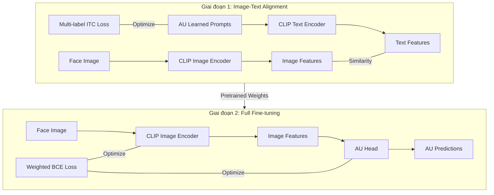

# Tổng Kết Triển Khai: AU Detection System (Two-Stage Training)

Dự án đã hoàn thành việc nâng cấp hệ thống nhận diện Facial Action Unit (AU) sang quy trình **huấn luyện hai giai đoạn**, giúp tận dụng tối đa khả năng Image-Text alignment của CLIP.

## Sơ đồ Hệ thống (Two-Stage Training Pipeline)



## Các Thành Phần Đã Triển Khai

| Component | Files | Description |
|---|---|---|
| **Data Processing** | [prepare_data.py](file:///d:/CLIP-ReID/prepare_data.py) | Xử lý DISFA labels thô sang CSV binary. |
| **Model** | [model/make_model.py](file:///d:/CLIP-ReID/model/make_model.py) | Tích hợp `AUPromptLearner` và `TextEncoder`. |
| **Two-Stage Processor** | [processor/processor_au_2stage.py](file:///d:/CLIP-ReID/processor/processor_au_2stage.py) | Logic Stage 1 (Alignment) và Stage 2 (Classification). |
| **Two-Stage Config** | [configs/au/vit_base_au_2stage.yaml](file:///d:/CLIP-ReID/configs/au/vit_base_au_2stage.yaml) | Cấu hình tham số riêng cho từng giai đoạn huấn luyện. |
| **Two-Stage Script** | [train_au_2stage.py](file:///d:/CLIP-ReID/train_au_2stage.py) | Script điều phối toàn bộ quá trình huấn luyện 2 giai đoạn. |
| **Explanation** | [au_explainer.py](file:///d:/CLIP-ReID/au_explainer.py) | Chuyển AU vector sang mô tả ngôn ngữ và cảm xúc. |

## Quy Trình Thực Hiện (Workflow)

### 1. Chuẩn bị dữ liệu
```bash
python prepare_data.py
```

### 2. Huấn luyện 2 giai đoạn (Two-Stage Training)
Chạy script huấn luyện mới:
```bash
python train_au_2stage.py --config_file configs/au/vit_base_au_2stage.yaml
```
- **Giai đoạn 1**: Học các AU Prompts bằng cách căn chỉnh với ảnh khuôn mặt.
- **Giai đoạn 2**: Fine-tune toàn bộ hệ thống để đạt độ chính xác phân loại cao nhất.

**Các tùy chọn bổ sung:**
- `--resume [path/to/checkpoint.pth]`: Tiếp tục huấn luyện từ một checkpoint có sẵn.
- `--skip_stage1`: Bỏ qua Giai đoạn 1 và bắt đầu ngay từ Giai đoạn 2 (thường dùng khi đã có trọng số Stage 1 tốt).

Ví dụ chạy thẳng Stage 2 từ trọng số Stage 1:
```bash
python train_au_2stage.py --resume logs/au_vit_base_2stage/ViT-B-16_au_stage1_10.pth --skip_stage1
```

### 3. Suy luận (Inference)
```bash
python inference_au.py --image_path path/to/face.jpg --weight_path logs/au_vit_base_2stage/ViT-B-16_au_stage2_30.pth
```

## Những Thay Đổi Quan Trọng
- **Multi-label ITC**: Stage 1 được điều chỉnh để xử lý multi-label (một ảnh tương đồng với nhiều AU prompts cùng lúc).
- **Learned Prompts**: Thay vì dùng text cố định, hệ thống học các vectors tối ưu cho từng Action Unit.
- **Sequential Optimization**: Tách biệt việc học ngữ nghĩa (Stage 1) và học phân loại (Stage 2) giúp model ổn định và chính xác hơn.

---
*Hệ thống đã được nâng cấp lên kiến trúc SOTA cho việc kết hợp CLIP và AU Detection.*
