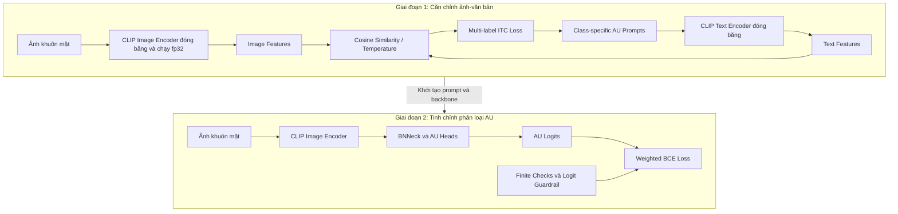

# Tổng Kết Triển Khai Hệ Thống Nhận Diện Facial Action Unit Theo Quy Trình Hai Giai Đoạn

Tài liệu này mô tả phiên bản hiện tại của hệ thống nhận diện Facial Action Unit (AU) trên DISFA, trong đó mô hình CLIP được điều chỉnh theo quy trình huấn luyện hai giai đoạn. Mục tiêu của thiết kế là tách biệt quá trình học căn chỉnh ngữ nghĩa ảnh-văn bản khỏi quá trình tối ưu hóa phân loại đa nhãn, qua đó cải thiện tính ổn định số học, khả năng tổng quát hóa theo chủ thể và khả năng diễn giải của biểu diễn AU.

## Kiến Trúc Tổng Quan


```mermaid
graph TD
    subgraph Stage1["Giai đoạn 1: Căn chỉnh ảnh-văn bản"]
        A[Ảnh khuôn mặt] --> B[CLIP Image Encoder đóng băng và chạy fp32]
        C[Class-specific AU Prompts] --> D[CLIP Text Encoder đóng băng]
        B --> E[Image Features]
        D --> F[Text Features]
        E --> G[Cosine Similarity / Temperature]
        F --> G
        G --> H[Multi-label ITC Loss]
        H --> C
    end

    subgraph Stage2["Giai đoạn 2: Tinh chỉnh phân loại AU"]
        I[Ảnh khuôn mặt] --> J[CLIP Image Encoder]
        J --> K[BNNeck và AU Heads]
        K --> L[AU Logits]
        L --> M[Weighted BCE Loss]
        N[Finite Checks và Logit Guardrail] --> M
    end

    Stage1 -->|Khởi tạo prompt và backbone| Stage2
```

## Thành Phần Triển Khai

| Thành phần | Tệp liên quan | Vai trò phương pháp |
|---|---|---|
| Xử lý dữ liệu DISFA | `prepare_data.py`, `datasets/disfa.py`, `datasets/make_dataloader.py` | Chuẩn hóa nhãn AU về dạng đa nhãn nhị phân và thiết lập chia fold theo chủ thể. |
| Mô hình CLIP-AU | `model/make_model.py`, `model/au_head.py` | Kết hợp CLIP image/text encoder, prompt learner và các đầu phân loại AU. |
| Huấn luyện hai giai đoạn | `processor/processor_au_2stage.py` | Định nghĩa mục tiêu Stage 1, Stage 2, đánh giá, checkpoint và cơ chế chẩn đoán lỗi số học. |
| Cấu hình thí nghiệm | `configs/au/vit_base_au_2stage.yaml` | Quy định siêu tham số riêng cho từng giai đoạn huấn luyện. |
| Bộ chạy thí nghiệm | `train_au_2stage.py` | Điều phối huấn luyện một fold hoặc toàn bộ các fold subject-exclusive. |
| Kiểm thử ổn định | `tests/test_stage2_stability.py`, `tests/test_disfa_protocol.py`, `tests/test_au_evaluator.py` | Kiểm tra loss đa nhãn, chia dữ liệu, logging và guardrail cho Stage 2. |

## Quy Ước Phân Tích, Ký Hiệu Và Công Thức

Các thay đổi mới trong hệ thống phải được mô tả theo cấu trúc học thuật: **vấn đề quan sát được**, **định nghĩa hiện tượng**, **cơ chế cũ**, **hệ quả của cơ chế cũ**, **cơ chế thay thế**, **công thức mới** và **kỳ vọng đo lường**. Cách viết này giúp liên kết trực tiếp giữa log thực nghiệm, nguyên nhân tối ưu hóa và quyết định sửa đổi mô hình.

Ký hiệu sử dụng trong tài liệu:

| Ký hiệu | Định nghĩa |
|---|---|
| `k` | Chỉ số Action Unit, với `k = 1, ..., K` và `K = 12` trong cấu hình DISFA hiện tại. |
| `y_k` | Nhãn nhị phân của AU thứ `k`, với `y_k = 1` nếu AU xuất hiện và `y_k = 0` nếu không xuất hiện. |
| `h` | Vector đặc trưng ảnh sau image encoder và BNNeck. |
| `z_k` | Logit của AU thứ `k`, tức giá trị trước hàm sigmoid. |
| `p_k` | Xác suất dự đoán của AU thứ `k`, được tính bởi `p_k = sigmoid(z_k)`. |
| `N_k^+` | Số mẫu dương của AU thứ `k` trong train split. |
| `N_k^-` | Số mẫu âm của AU thứ `k` trong train split. |
| `pi_k` | Empirical class prior, tức tần suất dương của AU thứ `k` trong train split. |
| `w_k^+` | Positive class weight của AU thứ `k` trong Weighted BCE. |
| `tilde_w_k^+` | Positive class weight sau khi làm mềm bằng power-tempering và clipping. |

Các công thức nền:

```text
pi_k = N_k^+ / (N_k^+ + N_k^-)
w_k^+ = N_k^- / N_k^+
pi_k = 1 / (1 + w_k^+)
```

Logit, xác suất và quyết định nhị phân tại ngưỡng `0.5`:

```text
p_k = sigmoid(z_k) = 1 / (1 + exp(-z_k))
y_hat_k = 1[p_k > 0.5] = 1[z_k > 0]
```

Weighted BCE cho từng AU:

```text
L_k = - w_k^+ y_k log(sigmoid(z_k))
      - (1 - y_k) log(1 - sigmoid(z_k))
```

Positive prediction rate được dùng trong log chẩn đoán:

```text
PosRate = (1 / (B K)) sum_i sum_k 1[sigmoid(z_{i,k}) > 0.5]
```

Trong đó `B` là batch size và `K` là số AU. Nếu `PosRate` cao hơn nhiều so với trung bình `pi_k`, mô hình có dấu hiệu **over-prediction** hoặc **class-prior miscalibration**.

Định nghĩa các hiện tượng chính:

| Thuật ngữ | Định nghĩa thực nghiệm | Dấu hiệu trong log | Hướng xử lý |
|---|---|---|---|
| **Optimization divergence** | Quá trình tối ưu mất ổn định, làm gradient, logits hoặc tham số tăng bất thường. | `GradNorm` tăng rất lớn, `MaxLogitAbs` vượt guardrail hoặc xuất hiện non-finite tensor. | Giảm độ khuếch đại loss, tắt AMP khi cần, giảm LR, clipping gradient, tách mục tiêu phụ. |
| **Class-prior miscalibration** | Xác suất hoặc tần suất dự đoán không tương thích với prior nhãn trong train split. | `EvalPosRate` cao hơn nhiều so với `pi_k`, dù logits hữu hạn. | Khởi tạo bias theo prior, hiệu chỉnh ngưỡng từng AU, theo dõi calibration. |
| **Power-tempered reweighting** | Làm mềm class weight bằng lũy thừa nhỏ hơn 1 để giảm gradient cực trị. | Raw `pos_weight` của AU hiếm quá lớn. | Thay `w_k^+` bằng `tilde_w_k^+ = min((w_k^+)^gamma, w_max)`. |
| **Prior-aware bias initialization** | Khởi tạo bias classifier sao cho xác suất ban đầu phản ánh prior dương của từng AU. | Head không bias tạo prior mặc định gần `0.5`. | Dùng `b_k^(0) = log(pi_k / (1 - pi_k)) = -log(w_k^+)`. |
| **Objective decoupling** | Tách mục tiêu học biểu diễn phụ khỏi mục tiêu phân loại chính khi hai mục tiêu gây xung đột. | ITC regularization kéo backbone khi Stage 2 cần tối ưu AU classification. | Đặt `ITC_LOSS_WEIGHT: 0.0` trong Stage 2 mặc định. |

## Các Cập Nhật Kỹ Thuật Mới

### 1. Prompt học riêng theo từng Action Unit

Stage 1 đã được mở rộng từ một ngữ cảnh prompt dùng chung cho toàn bộ AU sang cơ chế **class-specific prompt learning** thông qua tham số `SOLVER.STAGE1.CLASS_SPECIFIC_PROMPTS`. Với cấu hình hiện tại, mỗi AU có một tập vector ngữ cảnh riêng, giúp mô hình biểu diễn tốt hơn các chuyển động cơ mặt có tính chất không đồng nhất, chẳng hạn `inner brow raiser`, `cheek raiser` hoặc `jaw drop`.

Về mặt phương pháp, thay đổi này làm tăng năng lực biểu diễn của prompt learner mà không mở khóa toàn bộ text encoder. Do đó, Stage 1 vẫn giữ bản chất là prompt tuning tham số thấp, nhưng tránh tình trạng mọi AU phải chia sẻ cùng một ngữ cảnh ngữ nghĩa. Cơ chế nạp checkpoint cũng được điều chỉnh để checkpoint Stage 1 cũ có tensor prompt dạng `[n_ctx, d]` có thể được mở rộng sang dạng `[num_aus, n_ctx, d]` khi cần.

### 2. Hiệu chỉnh siêu tham số Stage 1 để giảm underfitting

Cấu hình Stage 1 trong `configs/au/vit_base_au_2stage.yaml` đã được điều chỉnh theo hướng phù hợp hơn với bài toán prompt tuning:

- `MAX_EPOCHS` tăng lên `30` để cho phép prompt hội tụ ổn định hơn.
- `BASE_LR` tăng lên `3e-4`, vì Stage 1 chỉ tối ưu một số lượng nhỏ vector ngữ cảnh; mức `1e-5` có xu hướng underfit.
- `WEIGHT_DECAY` đặt bằng `0.0` nhằm tránh làm suy giảm trực tiếp các vector prompt đang được học.
- `WARMUP_EPOCHS` và `WARMUP_LR_INIT` được điều chỉnh để giảm dao động ban đầu khi học prompt riêng cho từng AU.

Khi diễn giải loss Stage 1, cần lưu ý rằng DISFA là bài toán đa nhãn mất cân bằng mạnh. Với positive rate trung bình xấp xỉ 10%, loss BCE của một mô hình ngẫu nhiên ở logit 0 là khoảng `0.693`, trong khi baseline hằng số tối ưu theo tần suất nhãn có thể thấp hơn đáng kể. Vì vậy, loss khoảng `0.5` cho thấy mô hình đã tốt hơn ngẫu nhiên nhưng vẫn còn dấu hiệu underfitting; đánh giá cần kết hợp thêm F1, AUC và đặc biệt là hiệu năng trên các AU hiếm.

### 3. Ổn định số học cho Stage 1

Stage 1 sử dụng CLIP image encoder như một bộ trích xuất đặc trưng đóng băng. Do đó, đặc trưng ảnh phải là đại lượng ổn định và không nên bị ảnh hưởng bởi mixed precision hoặc trạng thái huấn luyện của các module không được tối ưu. Hệ thống hiện buộc nhánh image encoder chạy trong ngữ cảnh fp32 ngay bên trong `forward` của từng replica DataParallel, thay vì chỉ dựa vào autocast context ở trainer.

Ngoài ra, image encoder và text encoder được đặt ở chế độ eval trong Stage 1, trong khi gradient vẫn được truyền qua text encoder để tối ưu prompt vectors. Thiết kế này giữ đúng mục tiêu prompt tuning: chỉ cập nhật prompt learner, đồng thời giảm nguy cơ sinh đặc trưng ảnh không hữu hạn do khác biệt trạng thái giữa các replica hoặc do mixed precision.

Stage 1 mặc định không dùng DataParallel (`USE_DATA_PARALLEL: false`). Lý do là giai đoạn này chỉ cần trích xuất đặc trưng ảnh từ image encoder đóng băng và tối ưu một số lượng nhỏ prompt vectors; lợi ích tốc độ của DataParallel không đủ lớn so với rủi ro bất ổn autocast theo từng shard GPU trên T4. Trainer cũng kiểm tra tính hữu hạn của ảnh đầu vào trước khi trích xuất đặc trưng. Nếu lỗi không hữu hạn vẫn xuất hiện, thông báo lỗi có thể phân biệt rõ giữa dữ liệu ảnh bất thường và lỗi sinh ra trong image encoder.

### 4. Ổn định số học cho Stage 2

Stage 2 đã được bổ sung các cơ chế bảo vệ nhằm hạn chế lỗi không hữu hạn trong quá trình tinh chỉnh ViT/CLIP:

- Tắt AMP mặc định ở Stage 2 (`AMP: false`) vì logits AU trên GPU T4 có thể tiến sát miền tràn fp16.
- Kiểm tra tính hữu hạn của ảnh đầu vào, logits, loss, gradient norm và tham số mô hình.
- Làm mềm `pos_weight` bằng `POS_WEIGHT_POWER` và `POS_WEIGHT_MAX` để tránh khuếch đại quá mức gradient của các AU rất hiếm trong giai đoạn fine-tuning.
- Tắt ITC regularization mặc định trong Stage 2 (`ITC_LOSS_WEIGHT: 0.0`), vì Stage 1 đã đảm nhiệm căn chỉnh ảnh-văn bản; Stage 2 được ưu tiên ổn định cho mục tiêu phân loại AU.
- Sử dụng `AdamW`, learning rate nhỏ hơn, warmup dài hơn và gradient clipping chặt hơn để giảm nguy cơ phân kỳ khi AU head còn mới khởi tạo.
- Thêm guardrail `MAX_LOGIT_ABS` để cảnh báo sớm logits có biên độ bất thường nhưng vẫn hữu hạn trong fp32.
- Sử dụng `FATAL_LOGIT_ABS` làm ngưỡng dừng cứng cho trường hợp logits hữu hạn nhưng đã thể hiện xu hướng phân kỳ rõ rệt.
- Khi người dùng chủ động bật AMP, trainer sẽ thử tính lại batch lỗi bằng fp32 và vô hiệu hóa AMP cho phần còn lại nếu phát hiện logits không ổn định.
- Khi lỗi vẫn tồn tại, hệ thống lưu diagnostic checkpoint để phục vụ phân tích hậu nghiệm.

Thiết kế này không che giấu lỗi mô hình; thay vào đó, nó phân biệt rõ lỗi do mixed precision với lỗi do dữ liệu, checkpoint hoặc tham số đã bị hỏng.

Phân tích hậu nghiệm trên các log lỗi cho thấy Stage 2 có hai dạng suy giảm khác nhau. Dạng thứ nhất là **optimization divergence**: gradient norm tăng từ mức hàng nghìn lên gần mười nghìn, train/eval positive rate lệch lên khoảng `0.5-0.67`, sau đó logits đạt biên độ hàng nghìn. Đây không còn là lỗi số học đơn thuần, mà là mất ổn định tối ưu dưới tác động cộng hưởng của mất cân bằng nhãn, learning-rate warmup và head phân loại mới khởi tạo.

Trong cơ chế cũ, Weighted BCE sử dụng trực tiếp hệ số dương:

```text
w_k^+ = N_k^- / N_k^+
L_k = - w_k^+ y_k log sigmoid(z_k) - (1 - y_k) log(1 - sigmoid(z_k))
```

Với các AU hiếm, `w_k^+` có thể rất lớn, ví dụ fold 0 có AU đạt khoảng `26.96`. Hệ quả là gradient trên một số positive samples bị khuếch đại quá mạnh, làm Stage 2 dễ phân kỳ khi backbone CLIP bắt đầu được fine-tune. Cơ chế mới sử dụng **power-tempered positive reweighting**:

```text
tilde_w_k^+ = min((w_k^+) ^ gamma, w_max)
gamma = POS_WEIGHT_POWER = 0.5
w_max = POS_WEIGHT_MAX = 8.0
```

Do đó, `26.96` được biến đổi thành khoảng `5.19`. Sự thay thế này vẫn bảo toàn thứ tự mất cân bằng giữa các AU, nhưng giảm độ dốc cực trị của hàm mất mát. Đồng thời, Stage 2 chuyển sang mục tiêu phân loại thuần:

```text
L_stage2_old = WBCE(z, y; w^+) + lambda_ITC L_ITC
L_stage2_new = WBCE(z, y; tilde_w^+) + 0 * L_ITC
```

Về mặt phương pháp, thay đổi này gọi là **loss re-scaling under class imbalance** kết hợp với **objective decoupling** giữa căn chỉnh ảnh-văn bản và phân loại AU. Khi chạy đúng cấu hình mới, log huấn luyện cần hiển thị cả raw và adjusted `pos_weight`, đồng thời ghi `Stage 2 ITC loss weight: 0.000`. Nếu một run vẫn sinh fatal logit guardrail, checkpoint diagnostic nên được xem như bằng chứng phân kỳ tối ưu, không nên resume tiếp từ checkpoint đó.

### 5. Hiệu chỉnh prior cho đầu phân loại AU

Sau khi đã kiểm soát được phân kỳ số học, log mới cho thấy dạng suy giảm thứ hai: **class-prior miscalibration**. Stage 2 không còn sinh logits vô hạn, nhưng `TrainPosRate` và `EvalPosRate` vẫn duy trì quanh `0.4`, cao hơn đáng kể so với prior dương suy ra từ train split. Với fold 0, `pos_weight = N^- / N^+` tương ứng prior dương:

```text
pi_k = N_k^+ / (N_k^+ + N_k^-)
pi_k = 1 / (1 + pos_weight_k)
```

Các giá trị này chỉ nằm khoảng `0.036-0.157`, trung bình xấp xỉ `0.10`. Do đó, positive rate dự đoán quanh `0.4` là bằng chứng mô hình bị lệch ngưỡng quyết định về phía dự đoán dương.

Trong cơ chế cũ, `AUHead` dùng `Linear(..., bias=False)`, nên logit của AU thứ `k` có dạng:

```text
z_k = w_k^T h
p_k = sigmoid(z_k)
y_hat_k = 1[p_k > 0.5] = 1[z_k > 0]
```

Vì BNNeck có xu hướng chuẩn hóa đặc trưng quanh trung tâm, việc loại bỏ bias tương đương với giả định prior ban đầu gần `0.5` cho mọi AU. Giả định này không phù hợp với AU detection, vì mỗi AU có xác suất xuất hiện khác nhau và dữ liệu DISFA mất cân bằng mạnh. Hệ quả là head phải vừa học đặc trưng phân biệt vừa tự dịch chuyển ngưỡng quyết định, làm tăng over-prediction và làm F1 tại ngưỡng `0.5` kém ổn định.

Cơ chế mới thay thế bằng **prior-aware bias initialization**:

```text
z_k = w_k^T h + b_k
b_k^(0) = log(pi_k / (1 - pi_k))
         = -log(N_k^- / N_k^+)
         = -log(pos_weight_k)
p_k^(0) = sigmoid(b_k^(0)) = pi_k
```

Như vậy, bias khởi tạo biến classifier từ trạng thái mặc định không có prior sang trạng thái có prior lớp. Cách sửa này không thay thế Weighted BCE; nó bổ sung một hiệu chỉnh ở mức logit để điểm xuất phát của mô hình tương thích với phân phối nhãn của train split. Trong quá trình fine-tuning, cả `w_k` và `b_k` vẫn được học bằng gradient descent.

Tương quan cũ - mới có thể tóm tắt như sau:

| Thành phần | Cơ chế cũ | Hệ quả quan sát | Cơ chế mới | Kỳ vọng đo lường |
|---|---|---|---|---|
| AU logit | `z_k = w_k^T h` | Ngưỡng quyết định bị neo tại `z_k = 0` | `z_k = w_k^T h + b_k` | Ngưỡng có thể dịch theo từng AU |
| Prior ban đầu | Mặc định gần `p=0.5` | `EvalPosRate` cao hơn mật độ nhãn thật | `p_k^(0)=pi_k` | `EvalPosRate` gần prior train split hơn |
| Bias classifier | `bias=False` | Head khó hiệu chỉnh class prior | `bias=True`, `b_k^(0)=-log(pos_weight_k)` | Cải thiện calibration và F1 tại threshold `0.5` |
| Loss mất cân bằng | Raw `w_k^+` | Gradient cực trị ở AU hiếm | `tilde_w_k^+ = min((w_k^+)^0.5, 8.0)` | Giảm nguy cơ divergence |

Khi chạy đúng, log khởi động sẽ ghi `Initialized AU head biases from train-split class priors`. Về mặt thực nghiệm, thay đổi này được kỳ vọng làm giảm over-prediction ban đầu, đưa `EvalPosRate` gần hơn với mật độ AU thực tế và cải thiện macro F1 ở ngưỡng đánh giá `0.5`. Nếu F1 vẫn thấp trong khi AUC tăng, bước tối ưu tiếp theo nên là **per-AU threshold calibration** trên validation fold thay vì tiếp tục tăng `pos_weight`.

### 6. Quy trình DISFA subject-exclusive

Bộ nạp dữ liệu AU sử dụng chia fold theo chủ thể nhằm tránh rò rỉ thông tin nhận dạng giữa train và validation. `pos_weight` của Weighted BCE được tính từ nhãn thuộc train split của từng fold, nhờ đó tránh việc sử dụng thống kê của tập validation trong quá trình tối ưu.

Khi chạy toàn bộ các fold, hệ thống ghi lại thông tin fold, danh sách chủ thể train/validation, số mẫu, `pos_weight` và các chỉ số đánh giá để phục vụ so sánh thực nghiệm.

### 7. Lịch sử huấn luyện và tiêu chí đánh giá

Stage 2 ghi lịch sử huấn luyện dưới dạng CSV/JSON và có thể sinh biểu đồ khi môi trường hỗ trợ `matplotlib`. Các chỉ số chính bao gồm F1, AUC, accuracy, DISFA-8 macro F1, train positive rate, eval positive rate, gradient norm và biên độ logits. Việc theo dõi đồng thời các đại lượng này giúp tránh kết luận chỉ dựa trên loss, vốn có thể bị ảnh hưởng mạnh bởi mất cân bằng nhãn.

## Quy Trình Thực Nghiệm

### 1. Chuẩn bị dữ liệu

```bash
python prepare_data.py
```

### 2. Huấn luyện đầy đủ hai giai đoạn

```bash
python train_au_2stage.py --config_file configs/au/vit_base_au_2stage.yaml
```

Trong chế độ này, Stage 1 học class-specific AU prompts, sau đó Stage 2 tinh chỉnh image encoder và AU heads bằng Weighted BCE.

Sau các thay đổi ổn định Stage 2, log khởi động hợp lệ nên bao gồm:

```text
Initialized AU head biases from train-split class priors
Using adjusted Stage 2 pos_weight for DISFA: [...]
Stage 2 ITC loss weight: 0.000
```

### 3. Chạy Stage 2 từ checkpoint Stage 1

```bash
python train_au_2stage.py \
  --config_file configs/au/vit_base_au_2stage.yaml \
  --resume logs/au_vit_base_2stage/ViT-B-16_au_stage1_best.pth \
  --skip_stage1
```

Lưu ý: sau khi bật class-specific prompts, nên huấn luyện lại Stage 1 để checkpoint phản ánh đúng cấu trúc prompt mới. Checkpoint cũ vẫn có thể được nạp nhờ cơ chế mở rộng tensor prompt, nhưng không nên dùng làm kết quả tối ưu cuối cùng.

### 4. Chạy toàn bộ subject-exclusive folds

```bash
python train_au_2stage.py \
  --config_file configs/au/vit_base_au_2stage.yaml \
  --all_folds
```

### 5. Suy luận

```bash
python inference_au.py \
  --image_path path/to/face.jpg \
  --weight_path logs/au_vit_base_2stage/ViT-B-16_au_stage2_best.pth
```

## Khuyến Nghị Diễn Giải Kết Quả

Loss Stage 1 không nên được xem là tiêu chí duy nhất. Do dữ liệu AU có phân phối dương thưa, một loss thấp không nhất thiết đồng nghĩa với khả năng phát hiện AU hiếm tốt. Thực nghiệm nên ưu tiên so sánh các cấu hình theo DISFA-8 macro F1, AU-wise F1/AUC và độ ổn định giữa các subject-exclusive folds.

Nếu Stage 1 tiếp tục dừng ở loss khoảng `0.5`, các hướng cải tiến tiếp theo nên được đánh giá có kiểm soát gồm: bổ sung positive weighting hoặc focal loss cho ITC, log riêng positive/negative BCE, hoặc fine-tune nhẹ một phần cuối của text encoder. Các thay đổi này cần được kiểm chứng bằng validation subject-exclusive để tránh cải thiện loss nhưng làm giảm khả năng tổng quát hóa.

## Kiểm Thử

Các thay đổi hiện tại đã được kiểm tra bằng:

```bash
python -m py_compile model/make_model.py processor/processor_au_2stage.py train_au_2stage.py config/defaults.py config/defaults_base.py
python -m pytest tests
```

Kết quả mong đợi: toàn bộ kiểm thử hiện có vượt qua, ngoại trừ các kiểm thử được đánh dấu skip theo điều kiện môi trường.
